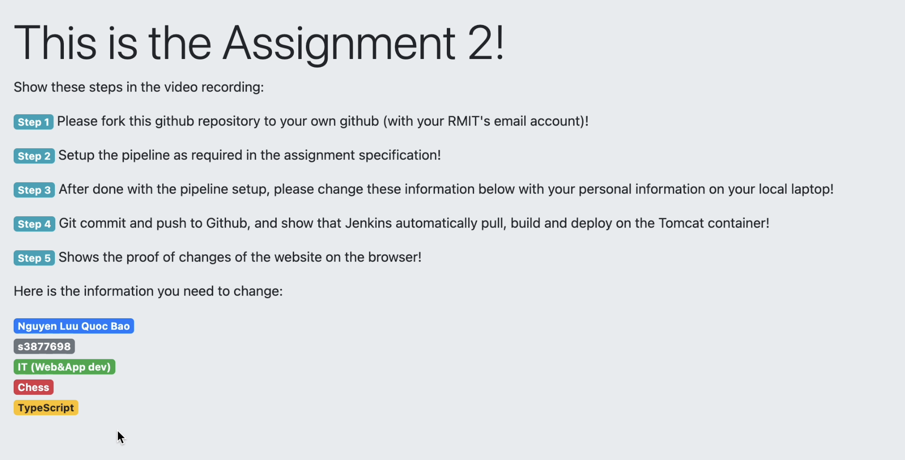

# [COSC2767] Systems Deployment and Operations - Assignment 2

## Description

Setting up a simple pipeline run every minutes if there is any changes

## Student information

- Name: Nguyen Luu Quoc Bao
- SID: S3877698
- Email: s3877698@rmit.edu.vn

## Assignment requirement mapping

- GitHub repo: https://github.com/b1amage/cosc2767-assignment2-website
- Video for main requirements: https://youtu.be/I56MmXN_XcU
- Video for additional requirements:
- Documentation:

## Folder structure

- **cosc2767\-assignment2\-website**
  - [README.md](README.md)
  - [devops\-a2.docx](devops-a2.docx)
  - [pom.xml](pom.xml)
  - **screenshots**
    - **ec2\-setup**
      - [1.1\-tomcat.png](screenshots/ec2-setup/1.1-tomcat.png)
      - [1.2\-tomcat\-ami.png](screenshots/ec2-setup/1.2-tomcat-ami.png)
      - [1.3\-tomcat\-keypair.png](screenshots/ec2-setup/1.3-tomcat-keypair.png)
      - [1.4\-tomcat\-keypair.png](screenshots/ec2-setup/1.4-tomcat-keypair.png)
      - [1.5\-tomcat\-sg.png](screenshots/ec2-setup/1.5-tomcat-sg.png)
      - [1.6\-tomcat\-sg\-custom\-port.png](screenshots/ec2-setup/1.6-tomcat-sg-custom-port.png)
      - [1.7\-launch.png](screenshots/ec2-setup/1.7-launch.png)
      - [2.1\-jenkins.png](screenshots/ec2-setup/2.1-jenkins.png)
      - [2.2\-jenkins\-ami.png](screenshots/ec2-setup/2.2-jenkins-ami.png)
      - [2.3\-jenkins\-keypair.png](screenshots/ec2-setup/2.3-jenkins-keypair.png)
      - [2.4\-jenkins\-sg.png](screenshots/ec2-setup/2.4-jenkins-sg.png)
      - [2.5\-jenkins\-sg.png](screenshots/ec2-setup/2.5-jenkins-sg.png)
      - [2.6\-launch.png](screenshots/ec2-setup/2.6-launch.png)
    - **jenkins**
      - [1. cat\-password.png](screenshots/jenkins/1.%20cat-password.png)
      - [10.create\-job.png](screenshots/jenkins/10.create-job.png)
      - [11. github.png](screenshots/jenkins/11.%20github.png)
      - [12.cred.png](screenshots/jenkins/12.cred.png)
      - [13.cred.png](screenshots/jenkins/13.cred.png)
      - [14.branch.png](screenshots/jenkins/14.branch.png)
      - [15.poll\-scm.png](screenshots/jenkins/15.poll-scm.png)
      - [16.setupwar.png](screenshots/jenkins/16.setupwar.png)
      - [17.tomcat.png](screenshots/jenkins/17.tomcat.png)
      - [18.commit.png](screenshots/jenkins/18.commit.png)
      - [19.trigger\-built.png](screenshots/jenkins/19.trigger-built.png)
      - [2.manage\-jenkins.png](screenshots/jenkins/2.manage-jenkins.png)
      - [20.web.png](screenshots/jenkins/20.web.png)
      - [3.plugins.png](screenshots/jenkins/3.plugins.png)
      - [4.plugins.png](screenshots/jenkins/4.plugins.png)
      - [5.tools.png](screenshots/jenkins/5.tools.png)
      - [6.jdk.png](screenshots/jenkins/6.jdk.png)
      - [7. Git.png](screenshots/jenkins/7.%20Git.png)
      - [8.maven.png](screenshots/jenkins/8.maven.png)
      - [9.create\-job.png](screenshots/jenkins/9.create-job.png)
  - **scripts**
    - [jenkins.md](scripts/jenkins.md)
    - [tomcat.md](scripts/tomcat.md)
  - **src**
    - **main**
      - **webapp**
        - **WEB\-INF**
          - [web.xml](src/main/webapp/WEB-INF/web.xml)
        - [index.jsp](src/main/webapp/index.jsp)
  - **videos**
    - [youtube\-banner.png](videos/youtube-banner.png)
